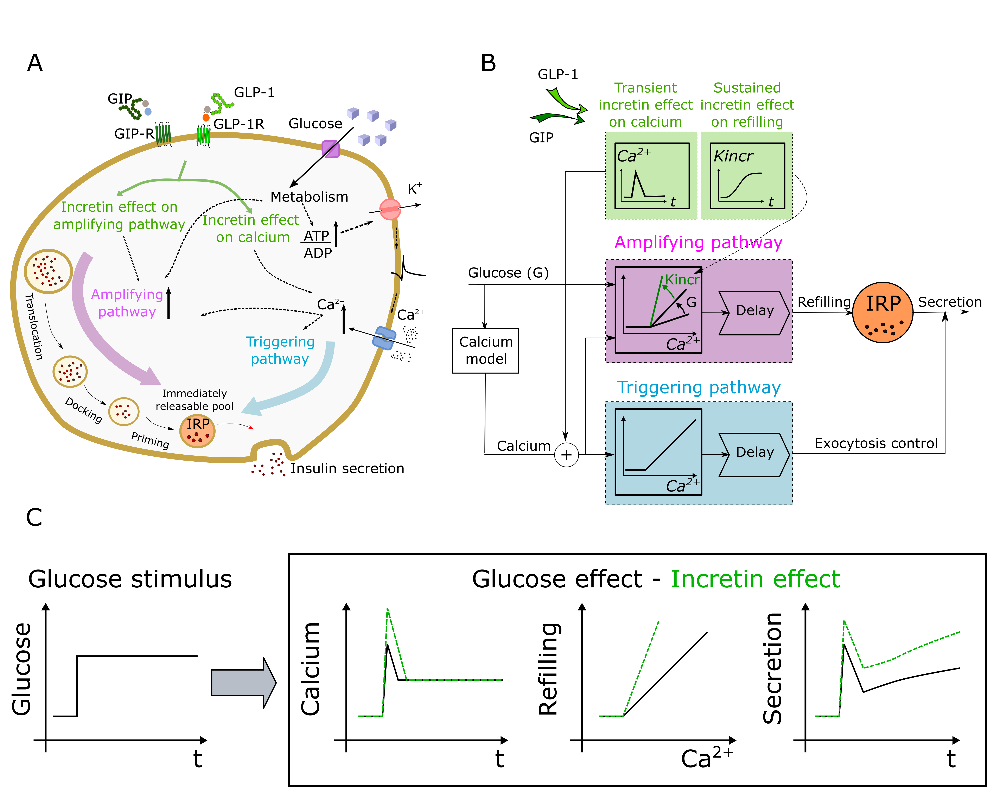

# Grespan-Mari's 2019 Incretin Model

This repository accompanies Grespan-Mari's 2019 Incretin Model described in the paper:

> E. Grespan, T. Giorgino, A. Natali, E. Ferrannini, A. Mari. *Different mechanisms of GIP
> and GLP-1 action explain their different therapeutic efficacy in type 2 diabetes*. (Preprint)

For an outline of the study, see *The different mechanisms of action of GIP and GLP-1 explain their different efficacy as therapeutic agents in type 2 diabetes*, [Diabetologia (2018) 61(Suppl 1)](https://doi.org/10.1007/s00125-018-4693-0) and [page 250, abstract #511](https://www.easd.org/virtualmeeting/home.html#!resources/the-different-mechanisms-of-action-of-gip-and-glp-1-explain-their-different-efficacy-as-therapeutic-agents-in-type-2-diabetes).

## Rationale

We have investigated the mechanisms of GIP and GLP-1 action, their impairment in type 2 diabetes and the reason underlying the lack of efficacy of GIP at pharmacological doses, an important unresolved question.

We have mathematically described the effects of incretins on cytosolic Ca2+ and on the glucose mediated amplifying pathway of insulin secretion. Based on experimental data in healthy subjects, we have concluded that GIP and GLP-1 increase insulin secretion rate by a transient Ca2+ increase and by potentiating the amplifying pathway. We found that potentiation of the amplifying pathway, described as an incretin-dependent factor Kincr > 1, is key characteristic of GIP and GLP-1 action. 

## Supplemental Material for the paper

This repository's [SI](SI) directory contains:

 * The paper's [Supplemental material](SI/Supplemental_Material.pdf).
 * The list of studies concerning the effect of GIP on insulin secretion retrieved from the PubMed search, in [PubMed search results.xlsx](SI/PubMed%20search%20results.xlsx) (MS Excel format).
 * The flow diagram displaying the selection criteria yielding the studies considered, [Search Flow Diagram.pdf](SI/Search%20Flow%20Diagram.pdf), formatted in analogy to the *Preferred Reporting Items for Systematic Reviews and Meta-Analyses* ([PRISMA](http://www.prisma-statement.org/)) guidelines.

## Model structure

The model extends [Grespan-Mari's beta-cell model](http://diabetes.diabetesjournals.org/content/67/3/496.abstract) 
incorporating the effect of the GIP and GLP-1 incretins.

## Results

We determined Kincr using data from eight in vivo published studies involving GIP and GLP-1 infusion or endogenous stimulation, in subjects with normal glucose tolerance and type 2 diabetes. We could thus reassess the GIP and GLP-1 effects from heterogeneous studies using a unifying method.  One reaches two main conclusions: 

 1. GIP action in type 2 diabetes is impaired (by ~50%) but not abolished, as often postulated; and
 2. the lack of efficacy of GIP at pharmacological doses in type 2 diabetes is not due GIP insensitivity but to the mechanism of GIP action, which, in contrast to GLP-1, presents a saturation already in the upper physiological range, even in healthy subjects.

## Output and preview

This code reproduces the paper's figures via Matlab's "publish" feature,
which renders an HTML file with inline comments and figures (tested in Matlab 2015b). The
rendered HTML and figures are found in the [html](html) directory of the repository. They may be previewed online
 [here](https://htmlpreview.github.io/?https://github.com/CNR-IN-MatMod/BetaCell2019/blob/master/html/IncretinModel_sim.html).
 
 

