<div class="content">

# Code for the beta-cell insulin secretion model incorporating the incretin effect

## Contents

<div>

  - [Parameters initialization](#2)
  - [- Study A1: GIP or GLP1 infusion at basal glucose - NGT
    subjects](#4)
  - [- Study A2: saline, GIP or GLP1 infusion at basal glucose - T2D
    subjects](#5)
  - [- Study B1: hiperglycemic clamp (HGC) with saline, GIP infusion or
    GLP1 infusion at different doses - NGT subjects](#6)
  - [- Study B1: hiperglycemic clamp (HGC) with saline, GIP infusion or
    GLP1 infusion at different doses - T2D subjects](#7)
  - [- Study B2: hyperglicaemic clamp (HGC) with saline, GIP or GLP1
    infusion - NGT subjects](#8)
  - [- Study B2: hyperglicaemic clamp (HGC) with saline, GIP or GLP1
    infusion - T2D subjects (pre glucose normalization)](#9)
  - [- Study B2: plot cpeptide](#10)
  - [- Study B3: hiperglycemic clamp (HGC) with saline or GIP infusion -
    NGT subjects](#11)
  - [- Study B3: hiperglycemic clamp (HGC) with saline, GIP infusion at
    different doses or GLP1 infusion - T2D subjects](#12)
  - [- Study B4: hyperglicaemic clamp (HGC) with boluses and infusion of
    GIP at different doses - NGT subjects](#13)
  - [- Study B4: hyperglicaemic clamp (HGC) with boluses and infusion of
    GIP at different doses - T2D subjects](#14)
  - [- Study C1: glucose ramp with saline infusion or GLP1 infusion at
    different doses - NGT subjects](#15)
  - [- Study C1: glucose ramp with saline infusion or GLP1 infusion at
    different doses - T2D subjects](#16)
  - [- Study D1: OGTT and Intravenous glucose infusion simulating an
    OGTT with saline, GIP or GLP1 infusion - NGT subjects](#17)
  - [Data analysis](#20)

</div>

``` codeinput
addpath(genpath('model_functions'))
```

## Parameters initialization<span id="2"></span>

The parameters are the result of the fit to the experimental data (see
below for the list of publications).

Each dataset (related to a specific experimental condition) and the
corresponding reference parameter vector are saved in a different file
.mat.

Each element of the p vector correspond to a parameter in the equations
of the article:

``` codeinput
% p(1)--> p6 in the equation of the article
% p(2)--> p7 in the equation of the article
% p(3)--> p8 in the equation of the article
% p(4)--> p9 in the equation of the article
% p(5)--> p10 in the equation of the article
% p(6)--> p11 in the equation of the article
% p(7)--> Parameter not used
% p(8)--> p5 in the equation of the article
% p(9)--> p1 in the equation of the article
% p(10)--> p2 in the equation of the article
% p(11)--> p3 in the equation of the article
% p(12)--> p4 in the equation of the article
% p(13)--> p15 in the equation of the article
% p(14)--> p14 in the equation of the article
% p(15)--> p12 in the equation of the article
% p(16)--> p13 in the equation of the article
% p(17)--> p21 in the equation of the article
% p(18)--> p22 in the equation of the article
% p(19)--> p23 in the equation of the article
% p(20)--> p24 in the equation of the article
% p(21)--> p16 in the equation of the article
% p(22)--> p17 in the equation of the article
% p(23)--> p18 in the equation of the article
```

The vector p\_peak is held fixed p\_peak(1)--\> p19 in the equation of
the article p\_peak(2)--\> p20 in the equation of the
article

## \- Study A1: GIP or GLP1 infusion at basal glucose - NGT subjects<span id="4"></span>

Data from Honka et al., 2018

``` codeinput
clear all
close all
clc

% load data
load Honka/Honka

% Calculate calcium from glucose
pca=[p_peak;p(17:23)]; % calcium parameter
camod=struct('t',{},'v',{});
for k=1:2
    camod(k)=casim(glu(k),pca);
end

% Add to calcium the transient increse due to the GIP or GLP-1
% GIP infusion (2 pmol/kg/min), GLP-1 infusion (0.75 pmol/kg/min)
camod_IE=struct('t',{},'v',{});
for k=1:2
    camod_IE(k).t=camod(k).t;
    camod_IE(k).v=camod(k).v+ca_transient(k).v;  % calcium with incretins
end

% Simulate secretion with the contribution of the incretin effect
secmod_IE=struct('t',{},'v',{});
for k=1:2
secmod_IE(k)=secsim_IE(p,camod_IE(k),glu(k),Kincr(k));
end

% Plot glucose, calcium, Kincr, secretion


subplot(4,1,1)
plot(glu(1).t,glu(1).v,'--b',glu(2).t,glu(2).v,'--r')
setAxes(-10, 80, 10, '', 3, 6, 3, 'G (mmol/L)') % generate the figure with the proper layout
subplot(4,1,2)
plot(camod_IE(1).t,camod_IE(1).v,'b',camod_IE(2).t,camod_IE(2).v,'r')
setAxes(-10, 80, 10, '', 50, 150, 3, 'C (nmol/L)')  % generate the figure with the proper layout
subplot(4,1,3)
plot(Kincr(1).t,Kincr(1).v,'b',Kincr(2).t,Kincr(2).v,'r')
setAxes(-10, 80, 10, '', 1, 5, 5, 'Kincr') % generate the figure with the proper layout
subplot(4,1,4)
plot(sec(1).t,sec(1).v,'--b',secmod_IE(1).t,secmod_IE(1).v/BSA,'b',...
    sec(2).t,sec(2).v,'--r',secmod_IE(2).t,secmod_IE(2).v/BSA,'r') %  model secretion needs to be normalized to body surface
setAxes(-10, 80, 10, 'Time (min)', ...
    0, 300, 3, 'S (pmol min^{-1}m^{-2})') % generate the figure with the proper layout
legend('GIP data','GIP model','GLP-1 data','GLP-1 model')
```

``` codeoutput
Warning: When delay time is set to zero, the transport delay block
'betavars/tau_k' is automatically set to support direct feedthrough. This may
cause an algebraic loop. A Memory Block can be used in place of the Transport
Delay to break the loop 
Warning: When delay time is set to zero, the transport delay block
'betavars/tau_k' is automatically set to support direct feedthrough. This may
cause an algebraic loop. A Memory Block can be used in place of the Transport
Delay to break the loop 
```

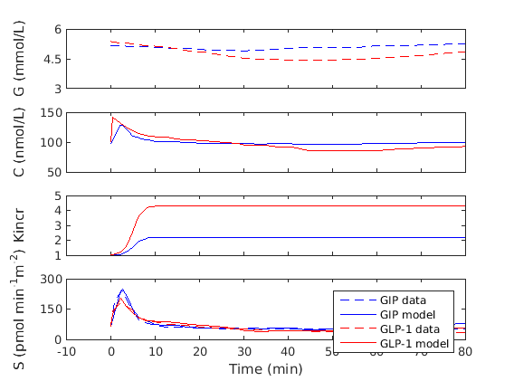

## \- Study A2: saline, GIP or GLP1 infusion at basal glucose - T2D subjects<span id="5"></span>

Data from Mentis et al., 2010

``` codeinput
clear all
close all
clc

% load data
load Mentis/Mentis

% Calculate calcium from glucose
pca=[p_peak;p(17:23)]; % calcium parameter
camod=casim(glu(1),pca); % calcium without incretins
% Simulate calcium - GIP infusion low dose (4 pmol/kg/min), GIP infusion
% high dose (16 pmol/kg/min), GLP1 infusion  (1 pmol/kg/min)
camod_IE=struct('t',{},'v',{});
catmp=struct('t',{},'v',{});
for k=1:2
    catmp(k)=casim(glu(k+1),pca);
    camod_IE(k).t=catmp(k).t;
    camod_IE(k).v=catmp(k).v+ca_transient.v; % calcium with incretins
end


% Simulate secretion - saline infusion
secmod=secsim_IE(p,camod,glu(1),Kglu);% Kglu is the potentiating ...
% effect of glucose during HGC, independent from the incretin effect but that affects the ..
% refilling as the incretin effect

% Simulate secretion with the contribution of the incretin effect
% GIP infusion low dose (4 pmol/kg/min), GIP infusion
% high dose (16 pmol/kg/min), GLP1 infusion  (1 pmol/kg/min)
Kincr_glu=struct('t',{},'v',{});
for k=1:2
    Kincr_glu(k).t=Kincr(k).t;
    Kincr_glu(k).v=Kincr(k).v.*Kglu.v;
end     % Kglu is the potentiating ...
% effect of glucose during HGC, independent from the incretin effect but that affects the ..
% refilling as the incretin effect
secmod_IE=struct('t',{},'v',{});
for k=1:2
    secmod_IE(k)=secsim_IE(p,camod_IE(k),glu(k+1),Kincr_glu(k));
end

% Calculate cpeptide
[pcp,~,~]=vancau('T2D','M',age,weight,height);

% cpeptide - saline infusion
cpepmod=cpepsim(pcp,glu(1).t,secmod);
% cpeptide - GIP infusion low dose (4 pmol/kg/min), GIP infusion
% high dose (16 pmol/kg/min), GLP1 infusion  (1 pmol/kg/min)
cpepmod_IE=struct('t',{},'v',{});
for k=1:2
    cpepmod_IE(k)=cpepsim(pcp,glu(k).t,secmod_IE(k));
end


% Plot glucose, calcium, Kincr, secretion


subplot(4,1,1)
plot(glu(1).t,glu(1).v,'--k',glu(2).t,glu(2).v,'--b',glu(3).t,glu(3).v,'--r')
setAxes(0, 240, 50, '', 5, 20, 4, 'G (mmol/L)') % generate the figure with the proper layout
subplot(4,1,2)
plot(camod.t,camod.v,'k',camod_IE(1).t,camod_IE(1).v,'b',camod_IE(2).t,camod_IE(2).v,'r')
setAxes(0, 240, 10, '', 50, 450, 5, 'C (nmol/L)')  % generate the figure with the proper layout
subplot(4,1,3)
plot(glu(1).t,ones(1,numel(glu(1).t)),'k',Kincr(1).t,Kincr(1).v,'b',...
    Kincr(2).t,Kincr(2).v,'r')
setAxes(0, 240,10, '', 1, 8, 8, 'Kincr') % generate the figure with the proper layout
subplot(4,1,4)
plot(secmod.t,secmod.v/BSA,'k',secmod_IE(1).t,secmod_IE(1).v/BSA,'b',...
    secmod_IE(2).t,secmod_IE(2).v/BSA,'r') %  model secretion needs to be normalized to body surface
setAxes(0, 360, 7, 'Time (min)', ...
    0, 600, 5, 'S (pmol Kg min^{-1})') % generate the figure with the proper layout
legend('saline model','GIP model','GLP1 model')


figure()
plot(cpep(1).t,cpep(1).v,'--k',cpepmod.t,cpepmod.v,'k',...
    cpep(2).t,cpep(2).v,'--b',cpepmod_IE(1).t,cpepmod_IE(1).v,'b',...
    cpep(3).t,cpep(3).v,'--r',cpepmod_IE(2).t,cpepmod_IE(2).v,'r');
setAxes(0, 360, 7, 'Time (min)', ...
    800, 1800, 6, 'C-peptide (pmol/L)') % generate the figure with the proper layout
legend('saline data','saline model','GIP data','GIP model','GLP1 data','GLP1 model')
```

``` codeoutput
Warning: When delay time is set to zero, the transport delay block
'betavars/tau_k' is automatically set to support direct feedthrough. This may
cause an algebraic loop. A Memory Block can be used in place of the Transport
Delay to break the loop 
Warning: When delay time is set to zero, the transport delay block
'betavars/tau_k' is automatically set to support direct feedthrough. This may
cause an algebraic loop. A Memory Block can be used in place of the Transport
Delay to break the loop 
Warning: When delay time is set to zero, the transport delay block
'betavars/tau_k' is automatically set to support direct feedthrough. This may
cause an algebraic loop. A Memory Block can be used in place of the Transport
Delay to break the loop 
```

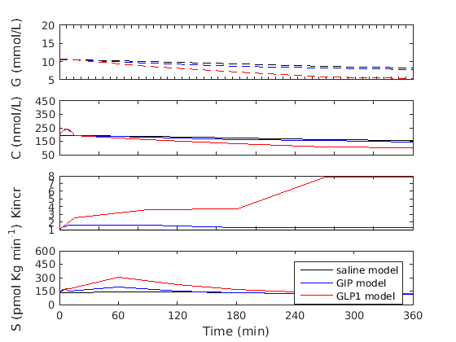
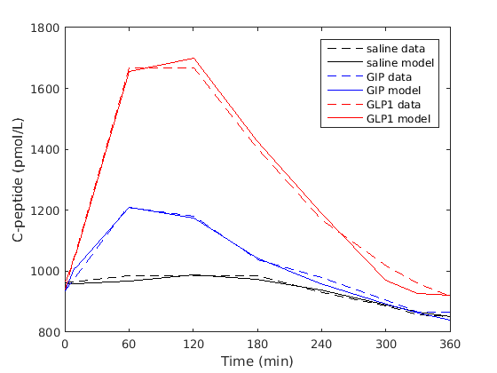

## \- Study B1: hiperglycemic clamp (HGC) with saline, GIP infusion or GLP1 infusion at different doses - NGT subjects<span id="6"></span>

Data from Nauck et al., JCI 1993

``` codeinput
clear all
close all
clc

% load data
load NauckJCI/NauckJCI_NGT


% Simulate calcium - saline infusion
pca=[p_peak;p(17:23)];% calcium parameter
camod=casim(glu,pca);
% Simulate calcium - GIP and GLP1 infusion
camod_IE=struct('t',{},'v',{});
for k=1:2
    camod_IE(k).t=camod.t;
    camod_IE(k).v=camod.v+ca_transient(k).v;
end

% Simulate secretion - saline infusion
secmod=secsim_IE(p,camod,glu,Kglu);% Kglu is the potentiating ...
% effect of glucose during HGC, independent from the incretin effect but that affects the ..
% refilling as the incretin effect

% Simulate secretion with the contribution of GIP or GLP1 infusion
Kincr_glu=struct('t',{},'v',{});
for k=1:2
    Kincr_glu(k).t=Kincr(k).t;
    Kincr_glu(k).v=Kincr(k).v.*Kglu.v;
end     % Kglu is the potentiating ...
% effect of glucose during HGC, independent from the incretin effect but that affects the ..
% refilling as the incretin effect
secmod_IE=struct('t',{},'v',{});
for k=1:2
    secmod_IE(k)=secsim_IE(p,camod_IE(k),glu,Kincr_glu(k));
end

% Calculate cpeptide
[pcp,~,~]=vancau('ND','M',age,weight,height);

% cpeptide - saline infusion
cpepmod=cpepsim(pcp,cpep(1).t,secmod);
% cpeptide - GIP infusion low dose (4 pmol/kg/min), GIP infusion
% high dose (16 pmol/kg/min), GLP1 infusion  (1 pmol/kg/min)
cpepmod_IE=struct('t',{},'v',{});
for k=1:2
    cpepmod_IE(k)=cpepsim(pcp,cpep(k+1).t,secmod_IE(k));
end

% Plot glucose, calcium, Kincr, secretion


subplot(4,1,1)
plot(glu.t,glu.v,'k')
setAxes(-20, 120, 8, '', 5, 10, 3, 'G (mmol/L)') % generate the figure with the proper layout
subplot(4,1,2)
plot(camod.t,camod.v,'k',camod_IE(1).t,camod_IE(1).v,'b',...
    camod_IE(2).t,camod_IE(2).v,'r')
setAxes(-20, 120, 8, '', 50, 350, 4, 'C (nmol/L)')  % generate the figure with the proper layout
subplot(4,1,3)
plot(glu.t,ones(1,numel(glu.t)),'k',Kincr(1).t,Kincr(1).v,'b',...
    Kincr(2).t,Kincr(2).v,'r')
setAxes(-20, 120,8, '', 1, 10, 3, 'Kincr') % generate the figure with the proper layout
subplot(4,1,4)
plot(secmod.t,secmod.v/BSA,'k',secmod_IE(1).t,secmod_IE(1).v/BSA,'b',...
    secmod_IE(2).t,secmod_IE(2).v/BSA,'r') %  model secretion needs to be normalized to body surface
setAxes(-30, 120, 6, 'Time (min)', ...
    0, 1500, 4, 'S (pmol Kg min^{-1})') % generate the figure with the proper layout
legend('saline model','GIP model','GLP1 model')


% Plot cpeptide
figure()
plot(cpep(1).t,cpep(1).v*1000,'--k',cpepmod.t,cpepmod.v,'k',...     % *1000 to express in pmol/L
    cpep(2).t,cpep(2).v*1000,'--b',cpepmod_IE(1).t,cpepmod_IE(1).v,'b',...
    cpep(3).t,cpep(3).v*1000,'--r',cpepmod_IE(2).t,cpepmod_IE(2).v,'r');
setAxes(-30, 120, 6, 'Time (min)', ...
    0, 8000, 5, 'C-peptide (pmol/L)') % generate the figure with the proper layout
legend('saline data','saline model','GIP data','GIP model','GLP1 data','GLP1 model')
```

``` codeoutput
Warning: When delay time is set to zero, the transport delay block
'betavars/tau_k' is automatically set to support direct feedthrough. This may
cause an algebraic loop. A Memory Block can be used in place of the Transport
Delay to break the loop 
Warning: When delay time is set to zero, the transport delay block
'betavars/tau_k' is automatically set to support direct feedthrough. This may
cause an algebraic loop. A Memory Block can be used in place of the Transport
Delay to break the loop 
Warning: When delay time is set to zero, the transport delay block
'betavars/tau_k' is automatically set to support direct feedthrough. This may
cause an algebraic loop. A Memory Block can be used in place of the Transport
Delay to break the loop 
```

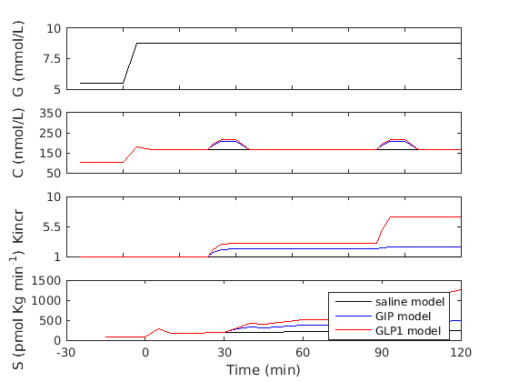


## \- Study B1: hiperglycemic clamp (HGC) with saline, GIP infusion or GLP1 infusion at different doses - T2D subjects<span id="7"></span>

Data from Nauck et al., JCI 1993

``` codeinput
clear all
close all
clc

% load data
load NauckJCI/NauckJCI_T2D


% Simulate calcium - saline infusion
pca=[p_peak;p(17:23)];% calcium parameter
camod=casim(glu,pca);
% Simulate calcium - GIP and GLP1 infusion
camod_IE=struct('t',{},'v',{});
for k=1:2
    camod_IE(k).t=camod.t;
    camod_IE(k).v=camod.v+ca_transient(k).v;
end

% Simulate secretion - saline infusion
secmod=secsim_IE(p,camod,glu,Kglu);% Kglu is the potentiating ...
% effect of glucose during HGC, independent from the incretin effect but that affects the ..
% refilling as the incretin effect

% Simulate secretion with the contribution of GIP or GLP1 infusion
Kincr_glu=struct('t',{},'v',{});
for k=1:2
    Kincr_glu(k).t=Kincr(k).t;
    Kincr_glu(k).v=Kincr(k).v.*Kglu.v;
end     % Kglu is the potentiating ...
% effect of glucose during HGC, independent from the incretin effect but that affects the ..
% refilling as the incretin effect
secmod_IE=struct('t',{},'v',{});
for k=1:2
    secmod_IE(k)=secsim_IE(p,camod_IE(k),glu,Kincr_glu(k));
end

% Calculate cpeptide
[pcp,~,~]=vancau('T2D','M',age,weight,height);

% cpeptide - saline infusion
cpepmod=cpepsim(pcp,cpep(1).t,secmod);
% cpeptide - GIP infusion low dose (4 pmol/kg/min), GIP infusion
% high dose (16 pmol/kg/min), GLP1 infusion  (1 pmol/kg/min)
cpepmod_IE=struct('t',{},'v',{});
for k=1:2
    cpepmod_IE(k)=cpepsim(pcp,cpep(k+1).t,secmod_IE(k));
end

% Plot glucose, calcium, Kincr, secretion


subplot(4,1,1)
plot(glu.t,glu.v,'k')
setAxes(-20, 120, 8, '', 5, 10, 3, 'G (mmol/L)') % generate the figure with the proper layout
subplot(4,1,2)
plot(camod.t,camod.v,'k',camod_IE(1).t,camod_IE(1).v,'b',...
    camod_IE(2).t,camod_IE(2).v,'r')
setAxes(-20, 120, 8, '', 50, 350, 4, 'C (nmol/L)')  % generate the figure with the proper layout
subplot(4,1,3)
plot(glu.t,ones(1,numel(glu.t)),'k',Kincr(1).t,Kincr(1).v,'b',...
    Kincr(2).t,Kincr(2).v,'r')
setAxes(-20, 120,8, '', 1, 10, 3, 'Kincr') % generate the figure with the proper layout
subplot(4,1,4)
plot(secmod.t,secmod.v/BSA,'k',secmod_IE(1).t,secmod_IE(1).v/BSA,'b',...
    secmod_IE(2).t,secmod_IE(2).v/BSA,'r') %  model secretion needs to be normalized to body surface
setAxes(-30, 120, 6, 'Time (min)', ...
    0, 1500, 4, 'S (pmol Kg min^{-1})') % generate the figure with the proper layout
legend('saline model','GIP model','GLP1 model')

% Plot cpeptide
figure()
plot(cpep(1).t,cpep(1).v*1000,'--k',cpepmod.t,cpepmod.v,'k',...   % *1000 to express in pmol/L
    cpep(2).t,cpep(2).v*1000,'--b',cpepmod_IE(1).t,cpepmod_IE(1).v,'b',...
    cpep(3).t,cpep(3).v*1000,'--r',cpepmod_IE(2).t,cpepmod_IE(2).v,'r');
setAxes(-30, 120, 6, 'Time (min)', ...
    0, 8000, 5, 'C-peptide (pmol/L)') % generate the figure with the proper layout
legend('saline data','saline model','GIP data','GIP model','GLP1 data','GLP1 model')
```

``` codeoutput
Warning: When delay time is set to zero, the transport delay block
'betavars/tau_k' is automatically set to support direct feedthrough. This may
cause an algebraic loop. A Memory Block can be used in place of the Transport
Delay to break the loop 
Warning: When delay time is set to zero, the transport delay block
'betavars/tau_k' is automatically set to support direct feedthrough. This may
cause an algebraic loop. A Memory Block can be used in place of the Transport
Delay to break the loop 
Warning: When delay time is set to zero, the transport delay block
'betavars/tau_k' is automatically set to support direct feedthrough. This may
cause an algebraic loop. A Memory Block can be used in place of the Transport
Delay to break the loop 
```


## \- Study B2: hyperglicaemic clamp (HGC) with saline, GIP or GLP1 infusion - NGT subjects<span id="8"></span>

Data from Hojberg et al., 2009

``` codeinput
clear all
close all
clc

% load data
load Hojberg/Hojberg_NGT


% Calculate calcium from glucose - saline infusion
pca=[p_peak;p(17:23)]; % calcium parameter
camod=casim(glu,pca);  % calcium with saline infusiomn
% Calculate calcium from glucose and GIP or GLP1 infusion
camod_IE.t=camod.t;
camod_IE.v=camod.v+ca_transient.v;

% Simulate secretion with saline infusion
secmod=secsim_IE(p,camod,glu,Kglu);% Kglu is the potentiating ...
% effect of glucose during HGC, independent from the incretin effect but that affects the ..
% refilling as the incretin effect

% Simulate secretion with the contribution of the incretin effect
Kincr_glu=struct('t',{},'v',{});% Kglu is the potentiating ...
% effect of glucose during HGC, independent from the incretin effect but that affects the ..
% refilling as the incretin effect
for k=1:2
    Kincr_glu(k).t=Kincr(k).t;
    Kincr_glu(k).v=Kincr(k).v.*Kglu.v;
end
secmod_IE=secsim_IE(p,camod_IE,glu,Kincr_glu(1),p,camod_IE,glu,Kincr_glu(2));

% Calculate cpeptide from secmod_IE
[pcp,~,~]=vancau('ND','M',age,weight,height);

cpepmod=cpepsim(pcp,glu.t,secmod);
cpepmod_IE=struct('t',{},'v',{});
for k=1:2
    cpepmod_IE(k)=cpepsim(pcp,glu.t,secmod_IE(k));
end


% Plot glucose, calcium, Kincr, secretion


subplot(4,1,1)
plot(glu.t,glu.v,'k')
setAxes(-15, 110, 9, '', 5, 20, 4, 'G (mmol/L)') % generate the figure with the proper layout
subplot(4,1,2)
plot(camod.t,camod.v,'k',camod_IE.t,camod_IE.v,'b')
setAxes(-15, 110, 9, '', 50, 400, 3, 'C (nmol/L)')  % generate the figure with the proper layout
subplot(4,1,3)
plot(glu.t,ones(1,numel(glu.t)),'k',Kincr(1).t,Kincr(1).v,'b',Kincr(2).t,Kincr(2).v,'b')
setAxes(-15, 110, 9, '', 1, 2, 3, 'Kincr') % generate the figure with the proper layout
subplot(4,1,4)
plot(secmod.t,secmod.v/BSA,'k',secmod_IE(1).t,secmod_IE(1).v/BSA,'r',secmod_IE(2).t,secmod_IE(2).v/BSA,'b') %  model secretion needs to be normalized to body surface
setAxes(-15, 105, 9, 'Time (min)', ...
    0, 1800, 7, 'S (pmol Kg min^{-1})') % generate the figure with the proper layout
legend('saline','GIP','GLP-1')
title('NGT')


cpep_NGT(1)=cpep(1);
cpep_NGT(2)=cpep(2);
cpep_NGT(3)=cpep(3);
cpepmod_NGT(1)=cpepmod;
cpepmod_NGT(2)=cpepmod_IE(1);
cpepmod_NGT(3)=cpepmod_IE(2);
```

``` codeoutput
Warning: When delay time is set to zero, the transport delay block
'betavars/tau_k' is automatically set to support direct feedthrough. This may
cause an algebraic loop. A Memory Block can be used in place of the Transport
Delay to break the loop 
Warning: When delay time is set to zero, the transport delay block
'betavars/tau_k' is automatically set to support direct feedthrough. This may
cause an algebraic loop. A Memory Block can be used in place of the Transport
Delay to break the loop 
Warning: When delay time is set to zero, the transport delay block
'betavars/tau_k' is automatically set to support direct feedthrough. This may
cause an algebraic loop. A Memory Block can be used in place of the Transport
Delay to break the loop 
```

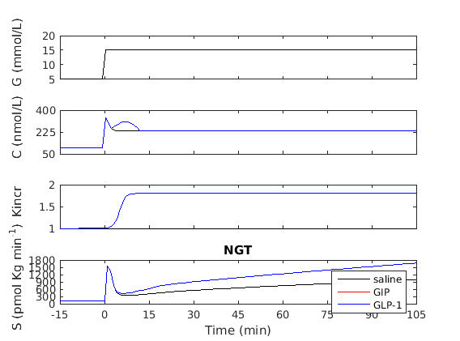

## \- Study B2: hyperglicaemic clamp (HGC) with saline, GIP or GLP1 infusion - T2D subjects (pre glucose normalization)<span id="9"></span>

Data from Hojberg et al., 2009

``` codeinput
%clear all
close all
clc

% load data
load Hojberg/Hojberg_T2D_pre


% Calculate calcium from glucose - saline infusion
pca=[p_peak;p(17:23,1)]; % calcium parameter
camod=casim(glu,pca);  % calcium with saline infusiomn
% Calculate calcium from glucose and GIP or GLP1 infusion
camod_IE.t=camod.t;
camod_IE.v=camod.v+ca_transient.v;

% Simulate secretion with saline infusion
secmod=secsim_IE(p(:,1),camod,glu,Kglu);% Kglu is the potentiating ...
% effect of glucose during HGC, independent from the incretin effect but that affects the ..
% refilling as the incretin effect

% Simulate secretion with the contribution of the incretin effect
Kincr_glu=struct('t',{},'v',{});% Kglu is the potentiating ...
% effect of glucose during HGC, independent from the incretin effect but that affects the ..
% refilling as the incretin effect
for k=1:2
    Kincr_glu(k).t=Kincr(k).t;
    Kincr_glu(k).v=Kincr(k).v.*Kglu.v;
end
secmod_IE=secsim_IE(p(:,2),camod_IE,glu,Kincr_glu(1),p(:,3),camod_IE,glu,Kincr_glu(2));

% Calculate cpeptide from secmod_IE
[pcp,~,~]=vancau('T2D','M',age,weight,height);

cpepmod=cpepsim(pcp,glu.t,secmod);
cpepmod_IE=struct('t',{},'v',{}); % calcium with the different GLP1 infusions (0.5,1 or 2 pmol/Kg/min)
for k=1:2
    cpepmod_IE(k)=cpepsim(pcp,glu.t,secmod_IE(k));
end


% Plot glucose, calcium, Kincr, secretion


subplot(4,1,1)
plot(glu.t,glu.v,'k')
setAxes(-15, 110, 9, '', 10, 20, 3, 'G (mmol/L)') % generate the figure with the proper layout
subplot(4,1,2)
plot(camod.t,camod.v,'k',camod_IE.t,camod_IE.v,'r')
setAxes(-15, 110, 9, '', 50, 350, 4, 'C (nmol/L)')  % generate the figure with the proper layout
subplot(4,1,3)
plot(glu.t,ones(1,numel(glu.t)),'k',Kincr(1).t,Kincr(1).v,'b',Kincr(2).t,Kincr(2).v,'r')
setAxes(-15, 110, 9, '', 1, 2, 3, 'Kincr') % generate the figure with the proper layout
subplot(4,1,4)
plot(secmod.t,secmod.v/BSA,'k',secmod_IE(1).t,secmod_IE(1).v/BSA,'b',secmod_IE(2).t,secmod_IE(2).v/BSA,'r') %  model secretion needs to be normalized to body surface
setAxes(-15, 105, 9, 'Time (min)', ...
    0, 300, 3, 'S (pmol Kg min^{-1})') % generate the figure with the proper layout
legend('saline','GIP','GLP-1')
title('T2D')


cpep_T2Dpre(1)=cpep(1);
cpep_T2Dpre(2)=cpep(2);
cpep_T2Dpre(3)=cpep(3);
cpepmod_T2Dpre(1)=cpepmod;
cpepmod_T2Dpre(2)=cpepmod_IE(1);
cpepmod_T2Dpre(3)=cpepmod_IE(2);
```

``` codeoutput
Warning: When delay time is set to zero, the transport delay block
'betavars/tau_k' is automatically set to support direct feedthrough. This may
cause an algebraic loop. A Memory Block can be used in place of the Transport
Delay to break the loop 
Warning: When delay time is set to zero, the transport delay block
'betavars/tau_k' is automatically set to support direct feedthrough. This may
cause an algebraic loop. A Memory Block can be used in place of the Transport
Delay to break the loop 
Warning: When delay time is set to zero, the transport delay block
'betavars/tau_k' is automatically set to support direct feedthrough. This may
cause an algebraic loop. A Memory Block can be used in place of the Transport
Delay to break the loop 
```

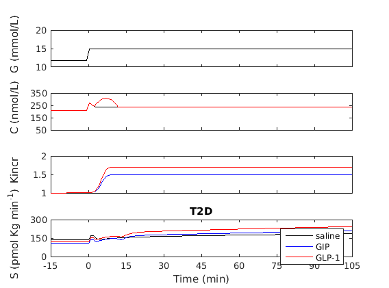

## \- Study B2: plot cpeptide<span id="10"></span>

``` codeinput
figure()
set(gcf,'position', [250 250 800 400])
subplot(1,3,1)
%Plot cpeptide - saline infusion in NGT and T2D pre glucose normalization
plot(cpep_NGT(1).t,cpep_NGT(1).v,'--k',cpepmod_NGT(1).t,cpepmod_NGT(1).v,'k',...
    cpep_T2Dpre(1).t,cpep_T2Dpre(1).v,'--r',cpepmod_T2Dpre(1).t,cpepmod_T2Dpre(1).v,'r')
setAxes(-15, 105, 9, 'Time(min)', 0, 12000, 7, 'C-peptide (pmol/L)') % generate the figure with the proper layout
title('Saline')
subplot(1,3,2)
%Plot cpeptide - GIP infusion in NGT and T2D pre glucose normalization
plot(cpep_NGT(2).t,cpep_NGT(2).v,'--k',cpepmod_NGT(2).t,cpepmod_NGT(2).v,'k',...
    cpep_T2Dpre(2).t,cpep_T2Dpre(2).v,'--r',cpepmod_T2Dpre(2).t,cpepmod_T2Dpre(2).v,'r')
setAxes(-15, 105, 9, 'Time(min)', 0, 12000, 7, '') % generate the figure with the proper layout
title('GIP')
subplot(1,3,3)
%Plot cpeptide - GLP1 infusion in NGT and T2D pre glucose normalization
plot(cpep_NGT(3).t,cpep_NGT(3).v,'--k',cpepmod_NGT(3).t,cpepmod_NGT(3).v,'k',...
    cpep_T2Dpre(3).t,cpep_T2Dpre(3).v,'--r',cpepmod_T2Dpre(3).t,cpepmod_T2Dpre(3).v,'r')
setAxes(-15, 105, 9, 'Time(min)', 0, 12000, 7, '') % generate the figure with the proper layout
title('GLP1')
legend('NGT data','NGT model','T2D data','T2D model')
```

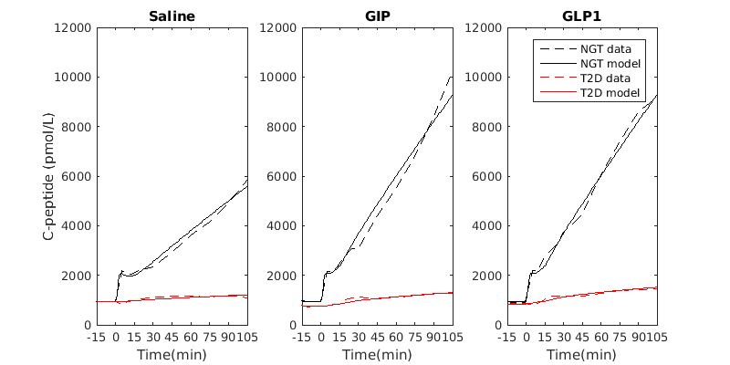

## \- Study B3: hiperglycemic clamp (HGC) with saline or GIP infusion - NGT subjects<span id="11"></span>

Data from Vilsboll et al., 2002

``` codeinput
clear all
close all
clc

% load data
load Vilsboll/Vilsboll_NGT_prot2

% Simulate calcium - saline infusion
pca=[p_peak;p(17:23)];% calcium parameter
camod=casim(glu,pca);
% Simulate calcium - GIP infusion low dose (4 pmol/kg/min)
camod_IE.t=camod.t;
camod_IE.v=camod.v+ca_transient.v;


% Simulate secretion - saline infusion
secmod=secsim_IE(p,camod,glu,Kglu);% Kglu is the potentiating ...
% effect of glucose during HGC, independent from the incretin effect but that affects the ..
% refilling as the incretin effect

% Simulate secretion with the contribution of the incretin effect
% GIP infusion low dose (4 pmol/kg/min)
Kincr_glu.t=Kincr.t;
Kincr_glu.v=Kincr.v.*Kglu.v; % Kglu is the potentiating ...
% effect of glucose during HGC, independent from the incretin effect but that affects the ..
% refilling as the incretin effect
secmod_IE=secsim_IE(p,camod_IE,glu,Kincr_glu);

% Calculate cpeptide
[pcp,~,~]=vancau('ND','M',age,weight,height);

% cpeptide - saline infusion
cpepmod=cpepsim(pcp,glu.t,secmod);
% cpeptide - GIP infusion low dose (4 pmol/kg/min)
cpepmod_IE=cpepsim(pcp,glu.t,secmod_IE);


% Plot glucose, calcium, Kincr, secretion

figure()
subplot(4,1,1)
plot(glu.t,glu.v,'k')
setAxes(-10, 140, 4, '', 5, 20, 4, 'G (mmol/L)') % generate the figure with the proper layout
subplot(4,1,2)
plot(camod.t,camod.v,'k',camod_IE.t,camod_IE.v,'b')
setAxes(-10, 140, 4, '', 50, 550, 6, 'C (nmol/L)')  % generate the figure with the proper layout
subplot(4,1,3)
plot(glu.t,ones(1,numel(glu.t)),'k',Kincr.t,Kincr.v,'b')
setAxes(-10, 140, 4, '', 1, 3, 3, 'Kincr') % generate the figure with the proper layout
subplot(4,1,4)
plot(secmod.t,secmod.v/BSA,'k',secmod_IE.t,secmod_IE.v/BSA,'b') %  model secretion needs to be normalized to body surface
setAxes(-10, 140, 4, 'Time', ...
    0, 2500, 6, 'S (pmol Kg min^{-1})') % generate the figure with the proper layout
legend('saline model','GIP model');
title('NGT')


%plot cpeptide
figure()
set(gcf,'position', [250 250 400 400])
pl=plot(cpep(1).t,cpep(1).v,'--k',cpepmod.t,cpepmod.v,'k',...
    cpep(2).t,cpep(2).v,'--b',cpepmod_IE.t,cpepmod_IE.v,'b');
xlabel('Time (min)','FontSize',16)
ylabel('C-peptide (pmol/L)','FontSize',16)
xlim([-10 120])
h=legend('saline data','saline model','GIP data','GIP model');
set(h,'Location','northwest')
title('NGT')
```

``` codeoutput
Warning: When delay time is set to zero, the transport delay block
'betavars/tau_k' is automatically set to support direct feedthrough. This may
cause an algebraic loop. A Memory Block can be used in place of the Transport
Delay to break the loop 
Warning: When delay time is set to zero, the transport delay block
'betavars/tau_k' is automatically set to support direct feedthrough. This may
cause an algebraic loop. A Memory Block can be used in place of the Transport
Delay to break the loop 
```

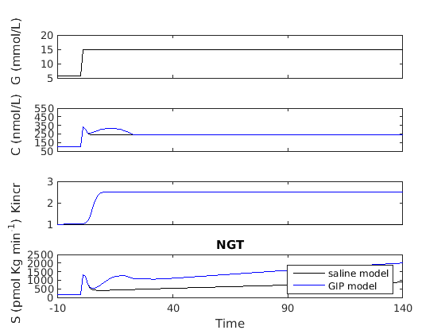
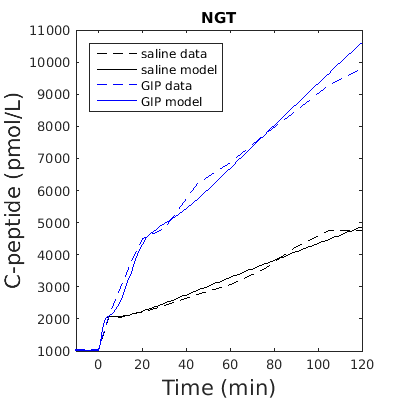

## \- Study B3: hiperglycemic clamp (HGC) with saline, GIP infusion at different doses or GLP1 infusion - T2D subjects<span id="12"></span>

Data from Vilsboll et al., 2002

``` codeinput
clear all
close all
clc

% load data
load Vilsboll/Vilsboll_T2D_prot2


% Simulate calcium - saline infusion
pca=[p_peak;p(17:23)];% calcium parameter
camod=casim(glu,pca);
% Simulate calcium - GIP infusion low dose (4 pmol/kg/min), GIP infusion
% high dose (16 pmol/kg/min), GLP1 infusion  (1 pmol/kg/min)
camod_IE=struct('t',{},'v',{});
for k=1:3
    camod_IE(k).t=camod.t;
    camod_IE(k).v=camod.v+ca_transient(k).v;
end


% Simulate secretion - saline infusion
secmod=secsim_IE(p,camod,glu,Kglu);% Kglu is the potentiating ...
% effect of glucose during HGC, independent from the incretin effect but that affects the ..
% refilling as the incretin effect

% Simulate secretion with the contribution of the incretin effect
% GIP infusion low dose (4 pmol/kg/min), GIP infusion
% high dose (16 pmol/kg/min), GLP1 infusion  (1 pmol/kg/min)
Kincr_glu=struct('t',{},'v',{});
for k=1:3
    Kincr_glu(k).t=Kincr(k).t;
    Kincr_glu(k).v=Kincr(k).v.*Kglu.v;
end     % Kglu is the potentiating ...
% effect of glucose during HGC, independent from the incretin effect but that affects the ..
% refilling as the incretin effect
secmod_IE=struct('t',{},'v',{});
for k=1:3
    secmod_IE(k)=secsim_IE(p,camod_IE(k),glu,Kincr_glu(k));
end

% Calculate cpeptide
[pcp,~,~]=vancau('T2D','M',age,weight,height);

% cpeptide - saline infusion
cpepmod=cpepsim(pcp,glu.t,secmod);
% cpeptide - GIP infusion low dose (4 pmol/kg/min), GIP infusion
% high dose (16 pmol/kg/min), GLP1 infusion  (1 pmol/kg/min)
cpepmod_IE=struct('t',{},'v',{});
for k=1:3
    cpepmod_IE(k)=cpepsim(pcp,glu.t,secmod_IE(k));
end


% Plot glucose, calcium, Kincr, secretion
figure()
subplot(4,1,1)
plot(glu.t,glu.v,'k')
setAxes(-10, 190, 11, '', 5, 20, 4, 'G (mmol/L)') % generate the figure with the proper layout
subplot(4,1,2)
plot(camod.t,camod.v,'k',camod_IE(1).t,camod_IE(1).v,'b',camod_IE(2).t,camod_IE(2).v,'g',camod_IE(3).t,camod_IE(3).v,'r')
setAxes(-10, 190, 11, '', 0, 400, 5, 'C (nmol/L)')  % generate the figure with the proper layout
subplot(4,1,3)
plot(glu.t,ones(1,numel(glu.t)),'k',Kincr(1).t,Kincr(1).v,'b',Kincr(2).t,Kincr(2).v,'g',Kincr(3).t,Kincr(3).v,'r')
setAxes(-10, 190, 11, '', 1, 8, 8, 'Kincr') % generate the figure with the proper layout
subplot(4,1,4)
plot(secmod.t,secmod.v/BSA,'k',secmod_IE(1).t,secmod_IE(1).v/BSA,'b',secmod_IE(2).t,secmod_IE(2).v/BSA,'g',secmod_IE(3).t,secmod_IE(3).v/BSA,'r') %  model secretion needs to be normalized to body surface
setAxes(-10, 190, 11, 'Time (min)', ...
    0, 2500, 6, 'S (pmol Kg min^{-1})') % generate the figure with the proper layout
legend('saline model','GIP model','GIP high model','GLP1 model')
title('T2D')


% plot cpeptide
figure()
set(gcf,'position', [250 250 400 400])
pl=plot(cpep(1).t,cpep(1).v,'--k',cpepmod.t,cpepmod.v,'k',...
    cpep(2).t,cpep(2).v,'--b',cpepmod_IE(1).t,cpepmod_IE(1).v,'b',...
    cpep(3).t,cpep(3).v,'--g',cpepmod_IE(2).t,cpepmod_IE(2).v,'g',...
    cpep(4).t,cpep(4).v,'--r',cpepmod_IE(3).t,cpepmod_IE(3).v,'r');
xlabel('Time (min)','FontSize',16)
ylabel('C-peptide (pmol/L)','FontSize',16)
xlim([-10 190])
h=legend('saline data','saline model','GIP data','GIP model','GIP high data','GIP high model',...
    'GLP1 data','GLP1 model');
set(h,'Location','northwest')
title('T2D')
```

``` codeoutput
Warning: When delay time is set to zero, the transport delay block
'betavars/tau_k' is automatically set to support direct feedthrough. This may
cause an algebraic loop. A Memory Block can be used in place of the Transport
Delay to break the loop 
Warning: When delay time is set to zero, the transport delay block
'betavars/tau_k' is automatically set to support direct feedthrough. This may
cause an algebraic loop. A Memory Block can be used in place of the Transport
Delay to break the loop 
Warning: When delay time is set to zero, the transport delay block
'betavars/tau_k' is automatically set to support direct feedthrough. This may
cause an algebraic loop. A Memory Block can be used in place of the Transport
Delay to break the loop 
Warning: When delay time is set to zero, the transport delay block
'betavars/tau_k' is automatically set to support direct feedthrough. This may
cause an algebraic loop. A Memory Block can be used in place of the Transport
Delay to break the loop 
```


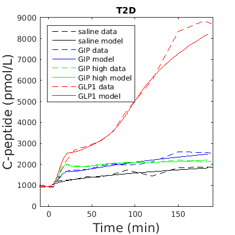

## \- Study B4: hyperglicaemic clamp (HGC) with boluses and infusion of GIP at different doses - NGT subjects<span id="13"></span>

Data from Meier et al., 2004;

``` codeinput
clear all
close all
clc

% load data
load Meier/Meier_NGT

% Calculate calcium from glucose
pca=[p_peak;p(17:23)]; % calcium parameter
camod=casim(glu,pca);

% Add to calcium the transient increse due to the incretin effect
camod_IE.t=camod.t;
camod_IE.v=camod.v+ca_transient.v;

% Simulate secretion with the contribution of the incretin effect
Kincr_glu.t=Kincr.t;
Kincr_glu.v=Kincr.v.*Kglu.v;  % Kglu is the potentiating ...
% effect of glucose during HGC, independent from the incretin effect but that affects the ..
% refilling as the incretin effect
secmod_IE=secsim_IE(p,camod_IE,glu,Kincr_glu);

% Calculate cpeptide from secmod_IE
[pcp,~,~]=vancau('ND','M',age,weight,height);
cpepmod_IE=cpepsim(pcp,glu.t,secmod_IE);

% Plot glucose, calcium, Kincr, secretion, cpeptide


subplot(5,1,1)
plot(glu.t,glu.v,'k')
setAxes(-60, 180, 9, '', 5, 15, 3, 'G (mmol/L)') % generate the figure with the proper layout
subplot(5,1,2)
plot(camod_IE.t,camod_IE.v,'b')
setAxes(-60, 180, 9, '', 0, 500, 3, 'C (nmol/L)')  % generate the figure with the proper layout
subplot(5,1,3)
plot(Kincr.t,Kincr.v,'b')
setAxes(-60, 180, 9, '', 1, 4, 4, 'Kincr') % generate the figure with the proper layout
subplot(5,1,4)
plot(sec.t,sec.v/BSA,'k',secmod_IE.t,secmod_IE.v/BSA,'b') %  sec has been calculated through deconvolution from cpeptide data,...
% secretion needs to be normalized to body surface
setAxes(-60, 180, 9, '', ...
    0, 1300, 3, 'S (pmol min^{-1}m^{-2})') % generate the figure with the proper layout
subplot(5,1,5)
plot(cpep.t,cpep.v,'k',cpepmod_IE.t,cpepmod_IE.v,'b');
setAxes(-60, 180, 9, 'Time (min)', ...
    0, 3500, 3, 'C-peptide (pmol/L)') % generate the figure with the proper layout
legend('data','model')
```

``` codeoutput
Warning: When delay time is set to zero, the transport delay block
'betavars/tau_k' is automatically set to support direct feedthrough. This may
cause an algebraic loop. A Memory Block can be used in place of the Transport
Delay to break the loop 
```

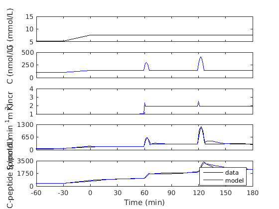

## \- Study B4: hyperglicaemic clamp (HGC) with boluses and infusion of GIP at different doses - T2D subjects<span id="14"></span>

Data from Meier et al., 2004;

``` codeinput
clear all
close all
clc

% load data
load Meier/Meier_T2D


% Calculate calcium from glucose
pca=[p_peak;p(17:23)]; % calcium parameter
camod=casim(glu,pca);

% Add to calcium the transient increse due to the incretin effect
camod_IE.t=camod.t;
camod_IE.v=camod.v+ca_transient.v;

% Simulate secretion with the contribution of the incretin effect
Kincr_glu.t=Kincr.t;
Kincr_glu.v=Kincr.v.*Kglu.v;  % Kglu is the potentiating ...
% effect of glucose during HGC, independent from the incretin effect but that affects the ..
% refilling as the incretin effect
secmod_IE=secsim_IE(p,camod_IE,glu,Kincr_glu);

% Calculate cpeptide from secmod_IE
[pcp,~,~]=vancau('ND','M',age,weight,height);
cpepmod_IE=cpepsim(pcp,glu.t,secmod_IE);

% Plot glucose, calcium, Kincr, secretion, cpeptide


subplot(5,1,1)
plot(glu.t,glu.v,'k')
setAxes(-60, 180, 9, '', 5, 15, 3, 'G (mmol/L)') % generate the figure with the proper layout
subplot(5,1,2)
plot(camod_IE.t,camod_IE.v,'k')
setAxes(-60, 180, 9, '', 0, 500, 3, 'C (nmol/L)')  % generate the figure with the proper layout
subplot(5,1,3)
plot(Kincr.t,Kincr.v,'k')
setAxes(-60, 180, 9, '', 1, 3, 3, 'Kincr') % generate the figure with the proper layout
subplot(5,1,4)
plot(sec.t,sec.v/BSA,'k',secmod_IE.t,secmod_IE.v/BSA,'b') %  sec has been calculated through deconvolution from cpeptide data,...
% secretion needs to be normalized to body surface
setAxes(-60, 180, 9, '', ...
    0, 500, 3, 'S (pmol min^{-1}m^{-2})') % generate the figure with the proper layout
subplot(5,1,5)
plot(cpep.t,cpep.v,'k',cpepmod_IE.t,cpepmod_IE.v,'b');
setAxes(-60, 180, 9, 'Time (min)', ...
    0, 1500, 3, 'C-peptide (pmol/L)') % generate the figure with the proper layout
legend('data','model')
```

``` codeoutput
Warning: When delay time is set to zero, the transport delay block
'betavars/tau_k' is automatically set to support direct feedthrough. This may
cause an algebraic loop. A Memory Block can be used in place of the Transport
Delay to break the loop 
```

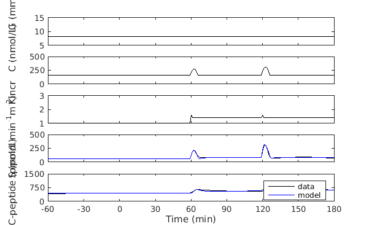

## \- Study C1: glucose ramp with saline infusion or GLP1 infusion at different doses - NGT subjects<span id="15"></span>

Data from Kjems et al., 2003

``` codeinput
clear all
close all
clc

% load data
load Kjems/Kjems_NGT

% Calculate calcium from glucose - saline infusion
pca=[p_peak;p(17:23)]; % calcium parameter
camod=casim(glu,pca);  % calcium with saline infusiomn
% Calculate calcium from glucose and GLP1 infusion
camod_IE=struct('t',{},'v',{}); % calcium with the different GLP1 infusions (0.5,1 or 2 pmol/Kg/min)
for k=1:3
    camod_IE(k).t=camod.t;
    camod_IE(k).v=camod.v+ca_transient(k).v;
end


% Simulate secretion with saline infusion
secmod=secsim(p,camod,glu);
% Simulate secretion with the different GLP1 infusions (0.5,1 or 2 pmol/Kg/min)
secmod_IE=secsim_IE(p,camod_IE(1),glu,Kincr(1),p,camod_IE(2),glu,Kincr(2),p,camod_IE(3),glu,Kincr(3));


% Calculate glucose sensitivity as reported in Fig. 6 of Kjems et al., 2003
gsmod.t=[0 0.5 1 2]; % GLP1 infusion doses
lin_reg=lreg(glu.v,secmod.v/BW);
gsmod.v(1)=lin_reg(1);
for k=1:3
    lin_reg=lreg(glu.v,secmod_IE(k).v/BW);
    gsmod.v(k+1)=lin_reg(1);
end

% Plot glucose, calcium, Kincr, secretion


subplot(4,1,1)
plot(glu.t,glu.v,'k')
setAxes(-5, 180, 7, '', 4, 12, 3, 'G (mmol/L)') % generate the figure with the proper layout
subplot(4,1,2)
plot(camod.t,camod.v,camod_IE(1).t,camod_IE(1).v,camod_IE(2).t,camod_IE(2).v,...
    camod_IE(3).t,camod_IE(3).v)
setAxes(-5, 180, 7, '', 50, 250, 3, 'C (nmol/L)')  % generate the figure with the proper layout
subplot(4,1,3)
plot(glu.t,ones(1,numel(glu.t)),Kincr(1).t,Kincr(1).v,Kincr(2).t,Kincr(2).v,...
    Kincr(3).t,Kincr(3).v)
setAxes(-5, 180, 7, '', 1, 12, 3, 'Kincr') % generate the figure with the proper layout
subplot(4,1,4)
plot(secmod.t,secmod.v/BW,secmod_IE(1).t,secmod_IE(1).v/BW,secmod_IE(2).t,secmod_IE(2).v/BW,...
    secmod_IE(3).t,secmod_IE(3).v/BW) %  model secretion needs to be normalized to body weight
setAxes(-5, 180, 7, 'Time (min)', ...
    0, 40, 3, 'S (pmol Kg min^{-1})') % generate the figure with the proper layout


% Figure 6 of Kjems et al., 2003 - NGT
figure()
set(gcf,'position', [250 250 400 400])
pl=plot(gsmod.t,gs,gsmod.t,gsmod.v,'--o');
xlabel('GLP1 (pmol kg^{-1} min^{-1})','FontSize',18)
ylabel('S vs G (pmol kg^{-1} min^{-1} / mmol L^{-1})','FontSize',18)
h=legend('NGT data','NGT model');
set(pl,'linewidth',2)
set(h,'Location','northwest')
```

``` codeoutput
Warning: When delay time is set to zero, the transport delay block
'betavars/tau_k' is automatically set to support direct feedthrough. This may
cause an algebraic loop. A Memory Block can be used in place of the Transport
Delay to break the loop 
Warning: When delay time is set to zero, the transport delay block
'betavars/tau_k' is automatically set to support direct feedthrough. This may
cause an algebraic loop. A Memory Block can be used in place of the Transport
Delay to break the loop 
Warning: When delay time is set to zero, the transport delay block
'betavars/tau_k' is automatically set to support direct feedthrough. This may
cause an algebraic loop. A Memory Block can be used in place of the Transport
Delay to break the loop 
Warning: When delay time is set to zero, the transport delay block
'betavars/tau_k' is automatically set to support direct feedthrough. This may
cause an algebraic loop. A Memory Block can be used in place of the Transport
Delay to break the loop 
```

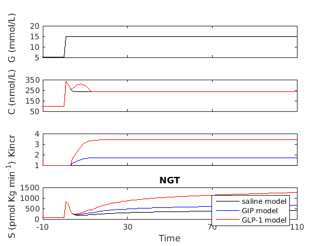
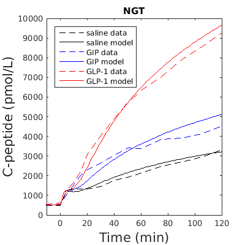

## \- Study C1: glucose ramp with saline infusion or GLP1 infusion at different doses - T2D subjects<span id="16"></span>

Data from Kjems et al., 2003

``` codeinput
clear all
close all
clc

% load data
load Kjems/Kjems_T2D


% Calculate calcium from glucose - saline infusion
pca=[p_peak;p(17:23)]; % calcium parameter
camod=casim(glu,pca);  % calcium with saline infusiomn
% Calculate calcium from glucose and GLP1 infusion
camod_IE=struct('t',{},'v',{}); % calcium with the different GLP1 infusions (0.5,1 or 2 pmol/Kg/min)
for k=1:3
    camod_IE(k).t=camod.t;
    camod_IE(k).v=camod.v+ca_transient(k).v;
end


% Simulate secretion with saline infusion
secmod=secsim(p,camod,glu);
% Simulate secretion with the different GLP1 infusions (0.5,1 or 2 pmol/Kg/min)
secmod_IE=secsim_IE(p,camod_IE(1),glu,Kincr(1),p,camod_IE(2),glu,Kincr(2),p,camod_IE(3),glu,Kincr(3));

% Calculate glucose sensitivity as reported in Fig. 6 of Kjems et al., 2003
gsmod.t=[0 0.5 1 2]; % GLP1 infusion doses
lin_reg=lreg(glu.v,secmod.v/BW);
gsmod.v(1)=lin_reg(1);
for k=1:3
    lin_reg=lreg(glu.v,secmod_IE(k).v/BW);
    gsmod.v(k+1)=lin_reg(1);
end

% Plot glucose, calcium, Kincr, secretion


subplot(4,1,1)
plot(glu.t,glu.v,'k')
setAxes(-5, 180, 7, '', 5, 15, 3, 'G (mmol/L)') % generate the figure with the proper layout
subplot(4,1,2)
plot(camod.t,camod.v,camod_IE(1).t,camod_IE(1).v,camod_IE(2).t,camod_IE(2).v,...
    camod_IE(3).t,camod_IE(3).v)
setAxes(-5, 180, 7, '', 50, 250, 3, 'C (nmol/L)')  % generate the figure with the proper layout
subplot(4,1,3)
plot(glu.t,ones(1,numel(glu.t)),Kincr(1).t,Kincr(1).v,Kincr(2).t,Kincr(2).v,...
    Kincr(3).t,Kincr(3).v)
setAxes(-5, 180, 7, '', 1, 8, 3, 'Kincr') % generate the figure with the proper layout
subplot(4,1,4)
plot(secmod.t,secmod.v/BW,secmod_IE(1).t,secmod_IE(1).v/BW,secmod_IE(2).t,secmod_IE(2).v/BW,...
    secmod_IE(3).t,secmod_IE(3).v/BW) %  model secretion needs to be normalized to body weight
setAxes(-5, 180, 7, 'Time (min)', ...
    0, 40, 3, 'S (pmol Kg min^{-1})') % generate the figure with the proper layout

% Figure 6 of Kjems et al., 2003 - T2D
figure()
set(gcf,'position', [250 250 400 400])
pl=plot(gsmod.t,gs,gsmod.t,gsmod.v,'--o');
xlabel('GLP1 (pmol kg^{-1} min^{-1})','FontSize',18)
ylabel('S vs G (pmol kg^{-1} min^{-1} / mmol L^{-1})','FontSize',18)
h=legend('T2D data','T2D model');
set(pl,'linewidth',2)
set(h,'Location','northwest')
```

``` codeoutput
Warning: When delay time is set to zero, the transport delay block
'betavars/tau_k' is automatically set to support direct feedthrough. This may
cause an algebraic loop. A Memory Block can be used in place of the Transport
Delay to break the loop 
Warning: When delay time is set to zero, the transport delay block
'betavars/tau_k' is automatically set to support direct feedthrough. This may
cause an algebraic loop. A Memory Block can be used in place of the Transport
Delay to break the loop 
Warning: When delay time is set to zero, the transport delay block
'betavars/tau_k' is automatically set to support direct feedthrough. This may
cause an algebraic loop. A Memory Block can be used in place of the Transport
Delay to break the loop 
Warning: When delay time is set to zero, the transport delay block
'betavars/tau_k' is automatically set to support direct feedthrough. This may
cause an algebraic loop. A Memory Block can be used in place of the Transport
Delay to break the loop 
```


## \- Study D1: OGTT and Intravenous glucose infusion simulating an OGTT with saline, GIP or GLP1 infusion - NGT subjects<span id="17"></span>

Data from Nauck et al., JCEM 1993

``` codeinput
clear all
close all
clc

% load data
load NauckJCEM/NauckJCEM


% Simulate calcium - OGTT IV
pca=[p_peak;p(17:23)];% calcium parameter
camod=casim(glu(1),pca);
% Simulate calcium - OGTT,OGTT IV + GIP infusion, GLP1 infusion, GIP and GLP1 infusion
camod_IE=struct('t',{},'v',{});
catmp=struct('t',{},'v',{});
for k=1:4
    catmp(k)=casim(glu(k+1),pca);
    camod_IE(k).t=catmp(k).t;
    camod_IE(k).v=catmp(k).v+ca_transient(k).v;
end

% Simulate secretion - OGTT IV
secmod=secsim(p,camod,glu(1));

% Simulate secretion - OGTT, OGTT IV + GIP infusion, GLP1 infusion, GIP and GLP1 infusion
secmod_IE=struct('t',{},'v',{});
for k=1:4
    secmod_IE(k)=secsim_IE(p,camod_IE(k),glu(k+1),Kincr(k));
end


% Calculate cpeptide
[pcp,~,~]=vancau('ND','M',age,weight,height);

% cpeptide - OGTT IV
cpepmod=cpepsim(pcp,glu(1).t,secmod);
% cpeptide - OGTT and OGTT IV + GIP infusion, GLP1 infusion, GIPA and GLP1 infusion
cpepmod_IE=struct('t',{},'v',{});
for k=1:4
    cpepmod_IE(k)=cpepsim(pcp,glu(k+1).t,secmod_IE(k));
end
```

``` codeoutput
Warning: When delay time is set to zero, the transport delay block
'betavars/tau_k' is automatically set to support direct feedthrough. This may
cause an algebraic loop. A Memory Block can be used in place of the Transport
Delay to break the loop 
Warning: When delay time is set to zero, the transport delay block
'betavars/tau_k' is automatically set to support direct feedthrough. This may
cause an algebraic loop. A Memory Block can be used in place of the Transport
Delay to break the loop 
Warning: When delay time is set to zero, the transport delay block
'betavars/tau_k' is automatically set to support direct feedthrough. This may
cause an algebraic loop. A Memory Block can be used in place of the Transport
Delay to break the loop 
Warning: When delay time is set to zero, the transport delay block
'betavars/tau_k' is automatically set to support direct feedthrough. This may
cause an algebraic loop. A Memory Block can be used in place of the Transport
Delay to break the loop 
Warning: When delay time is set to zero, the transport delay block
'betavars/tau_k' is automatically set to support direct feedthrough. This may
cause an algebraic loop. A Memory Block can be used in place of the Transport
Delay to break the loop 
```

Plot glucose, calcium, Kincr, secretion - OGTT-like

``` codeinput
subplot(4,1,1)
plot(glu(1).t,glu(1).v,'k')
setAxes(-30, 220, 6, '', 5, 15, 3, 'G (mmol/L)') % generate the figure with the proper layout
title('OGTT like')
subplot(4,1,2)
plot(camod.t,camod.v,'k')
setAxes(-30, 220, 6, '', 50, 250, 5, 'C (nmol/L)')  % generate the figure with the proper layout
subplot(4,1,3)
plot(glu(1).t,ones(1,numel(glu(1).t)),'k')
setAxes(-30, 220, 6, '', 0.5, 1.5, 3, 'Kincr') % generate the figure with the proper layout
subplot(4,1,4)
plot(secmod.t,secmod.v/BSA,'k') %  model secretion needs to be normalized to body surface
setAxes(-30, 220, 6, 'Time (min)', ...
    0, 500, 3, 'S (pmol Kg min^{-1})') % generate the figure with the proper layout

titles={'OGTT' 'GIP infusion' 'GLP-1 infusion' 'GIP and GLP-1 infusion'};
```


``` codeinput
figure()
for k=1:4
subplot(4,1,1)
plot(glu(k+1).t,glu(k+1).v,'k')
setAxes(-30, 220, 6, '', 5, 15, 3, 'G (mmol/L)') % generate the figure with the proper layout
title(sprintf(titles{k}))
subplot(4,1,2)
plot(camod_IE(k).t,camod_IE(k).v,'k')
setAxes(-30, 220, 6, '', 50, 250, 5, 'C (nmol/L)')  % generate the figure with the proper layout
subplot(4,1,3)
plot(Kincr(k).t,Kincr(k).v,'k')
setAxes(-30, 220, 6, '', 1, 5, 5, 'Kincr') % generate the figure with the proper layout
subplot(4,1,4)
plot(secmod_IE(k).t,secmod_IE(k).v/BSA,'k') %  model secretion needs to be normalized to body surface
setAxes(-30, 220, 6, 'Time (min)', ...
    0, 800, 5, 'S (pmol Kg min^{-1})') % generate the figure with the proper layout
end

% Plot cpeptide
figure()
plot(cpep(1).t,cpep(1).v,'--k',cpepmod.t,cpepmod.v,'k',...
    cpep(2).t,cpep(2).v,'--g',cpepmod_IE(1).t,cpepmod_IE(1).v,'-g');
setAxes(-30, 220, 6, 'Time (min)', ...
    0, 4000, 5, 'C-peptide (pmol/L)') % generate the figure with the proper layout
legend('OGTT IV data','OGTT IV model','OGTT data','OGTT model')


figure()
plot(cpep(3).t,cpep(3).v,'--b',cpepmod_IE(2).t,cpepmod_IE(2).v,'b',...
    cpep(4).t,cpep(4).v,'--r',cpepmod_IE(3).t,cpepmod_IE(3).v,'-r',...
     cpep(5).t,cpep(5).v,'--m',cpepmod_IE(4).t,cpepmod_IE(4).v,'-m');
setAxes(-30, 220, 6, 'Time (min)', ...
    0, 4000, 5, 'C-peptide (pmol/L)') % generate the figure with the proper layout
legend('GIP data','GIP model','GLP1 data','GLP1 model','GIP and GLP1 data','GIP and GLP1 model')
```

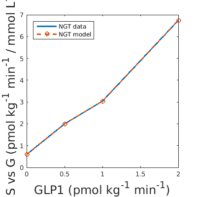 


## Data analysis<span id="20"></span>

For each test we created a vector containing 6 elements: - element 1 of
the vector: GIP or GLP1 infusion rate (pmol/kg/min) - element 2 of the
vector GIP or GLP1 basal concentration (pmol/L) - total GIP or GLP1 -
element 3 of the vector: AUC Kincr - element 4 of the vector: AUC
calcium transient due to the incretin effect (nmol/L) - element 5 of the
vector: AUC glu during the incretins stimulus (mmol/L) - element 6 of
the vecotr: AUC of GIP or GLP1 concentration (pmol/L) - total GIP or
GLP1 The vectors are saved in the file
analysis\_all\_tests

``` codeinput
% Element 2 and element 6 of the vectors referring to Nauck JCI and Nauck
% JCEM studies are already rescaled as described in the methods part of the
% article of Grespan et al. 2019

clear all
close all
clc
load analysis_all_tests


% plot GIP and GLP1 concentration vs Kincr calculated by the model for all
% the diffferent tests
load Kincrmod

figure()
subplot(1,2,1)
p1=plot(test_GIP_NGT_Meier(:,6),test_GIP_NGT_Meier(:,3),'ob',...
    test_GIP_NGT_Honka(:,6),test_GIP_NGT_Honka(:,3),'sb',...
    test_GIP_NGT_Hojberg(:,6),test_GIP_NGT_Hojberg(:,3),'^b',...
    test_GIP_NGT_Vilsboll(:,6),test_GIP_NGT_Vilsboll(:,3),'*b',...
    test_GIP_NGT_NauckJCI(:,6),test_GIP_NGT_NauckJCI(:,3),'xb',...
    test_GIP_NGT_NauckJCEM(:,6),test_GIP_NGT_NauckJCEM(:,3),'+b',...
    test_GIP_GIPANDGLP1_NGT_NauckJCEM(:,6),test_GIP_GIPANDGLP1_NGT_NauckJCEM(:,3),'+b',...
    Kincrmod_GIP_NGT(1).t,Kincrmod_GIP_NGT(1).v,'-b',...
    test_GLP1_NGT_Honka(:,6),test_GLP1_NGT_Honka(:,3),'sr',...
    test_GLP1_NGT_Kjems(:,6),test_GLP1_NGT_Kjems(:,3),'dr',...
    test_GLP1_NGT_Hojberg(:,6),test_GLP1_NGT_Hojberg(:,3),'^r',...
    test_GLP1_NGT_NauckJCI(:,6),test_GLP1_NGT_NauckJCI(:,3),'xr',...
    test_GLP1_NGT_NauckJCEM(:,6),test_GLP1_NGT_NauckJCEM(:,3),'+r',...
    test_GLP1_GIPANDGLP1_NGT_NauckJCEM(:,6),test_GLP1_GIPANDGLP1_NGT_NauckJCEM(:,3),'+r',...
    Kincrmod_GLP1_NGT(1).t,Kincrmod_GLP1_NGT(1).v,'-r');
xlim([0 500])
ylim([1 10])
xlabel('Total hormone concentration (pmol/L)')
ylabel('Incretin potentiation of ISR (k_{incr})')
set(p1,'linewidth',2)
set(gca,'FontSize',14)
title('NGT')

subplot(1,2,2)
p1=plot(test_GIP_T2D_Mentis(:,6),test_GIP_T2D_Mentis(:,3),'vb',...
    test_GIP_T2D_Meier(:,6),test_GIP_T2D_Meier(:,3),'ob',...
    test_GIP_T2Dpre_Hojberg(:,6),test_GIP_T2Dpre_Hojberg(:,3),'^b',...
    test_GIP_T2D_Vilsboll(:,6),test_GIP_T2D_Vilsboll(:,3),'*b',...
    test_GIP_T2D_NauckJCI(:,6),test_GIP_T2D_NauckJCI(:,3),'xb',...
    Kincrmod_GIP_T2D.t,Kincrmod_GIP_T2D.v,'-b',...
    test_GLP1_T2D_Mentis(:,6),test_GLP1_T2D_Mentis(:,3),'vr',...
    test_GLP1_T2D_Kjems(:,6),test_GLP1_T2D_Kjems(:,3),'dr',...
    test_GLP1_T2Dpre_Hojberg(:,6),test_GLP1_T2Dpre_Hojberg(:,3),'^r',...
    test_GLP1_T2D_Vilsboll(:,6),test_GLP1_T2D_Vilsboll(:,3),'*r',...
    test_GLP1_T2D_NauckJCI(:,6),test_GLP1_T2D_NauckJCI(:,3),'xr',...
    Kincrmod_GLP1_T2D.t,Kincrmod_GLP1_T2D.v,'-r');
xlim([0 500])
ylim([1 10])
%set(gca,'xTick',[0 1 2 3 4 8 12 16])
xlabel('Total hormone concentration (pmol/L)')
ylabel('Incretin potentiation of ISR (k_{incr})')
set(p1,'linewidth',2)
set(gca,'FontSize',14)
title('T2D')


% plot hormone-Kincr relationship used to simulate Study D1
figure()
p1=plot(Kincrmod_GIP_NGT(2).t,Kincrmod_GIP_NGT(2).v,'-b',...
    Kincrmod_GLP1_NGT(2).t,Kincrmod_GLP1_NGT(2).v,'-r');
xlim([0 400])
ylim([1 10])
xlabel('Total hormone concentration (pmol/L)')
ylabel('Incretin potentiation of ISR (k_{incr})')
set(p1,'linewidth',2)
set(gca,'FontSize',14)
title('NGT')
```

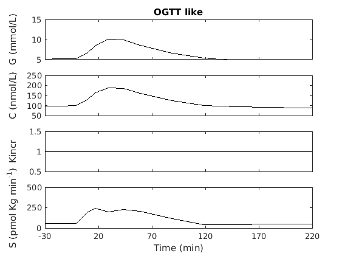 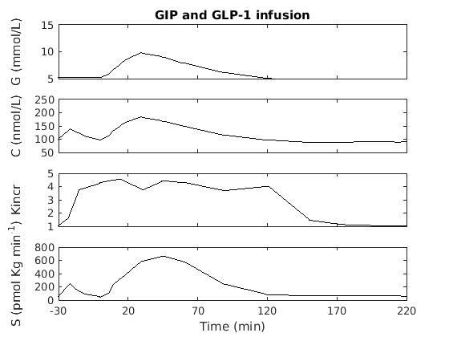

  
[Published with MATLAB®
R2015b](http://www.mathworks.com/products/matlab/)  

</div>
